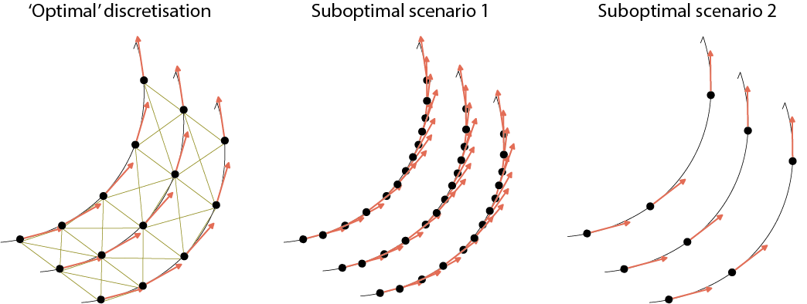

# MARBLE - Manifold Representation Basis Learning

MARBLE is a fully unsupervised geometric deep-learning method that can 

1. intrinsically represent vector fields over manifolds, such as those arising in neural recordings or dissipative dynamical systems, but it is not limited to dynamical systems
2. perform unbiased comparisons across dynamical systems or parameter conditions by jointly embedded representations
3. can operate in geometry-aware or geometry-agnostic modes to test the contribution of manifold dynamics and geometry.

The code is built around [PyG (PyTorch Geometric)](https://pytorch-geometric.readthedocs.io/en/latest/notes/installation.html).

## Cite

If you find this package useful or inspirational, please cite our work as follows

```
@misc{gosztolai2023interpretable,
      title={Interpretable statistical representations of neural population dynamics and geometry}, 
      author={Adam Gosztolai and Robert L. Peach and Alexis Arnaudon and Mauricio Barahona and Pierre Vandergheynst},
      year={2023},
      eprint={2304.03376},
      archivePrefix={arXiv},
      primaryClass={cs.LG}
}
```

## Documentation

See full documentation [here](https://agosztolai.github.io/MARBLE/).


## Installation

The code is tested for CPU and GPU (CUDA) machines running Linux or OSX. Although smaller examples run fast on CPU, for larger datasets, it is highly recommended that you use a GPU machine.

We recommend you install the code in a fresh Anaconda virtual environment, as follows.

- First, clone this repository, 

```
git clone https://github.com/agosztolai/MARBLE
```

- Then, create a new anaconda environment using the provided environment file that matches your system.
  - For Linux machines with CUDA:

  `conda env create -f environment.yml`
  - For Intel-based Mac:

  `conda env create -f environment_osx_intel.yml`

  - For recent M1/M2/M3 Mac:
    - Install cmake `brew install cmake` or use the installer on the [cmake website](https://cmake.org/download/)
    - Create the environment

        `conda env create -f environment_osx_arm.yml`
    - Activate the environment `conda activate MARBLE` 
    - Install PyTorch geometric
    `pip install -r requirements_osx_arm.txt`

  - For Windows computers:
  we recommend using WSL2, which allows running a (virtual) Linux machine inside your Windows computer, which makes the installation simpler. If you have a NVIDIA GPU, WSL2 will allow you to take advantage of the GPU (an older version of WSL will not).
    - Follow the [instructions to install WSL2](https://learn.microsoft.com/en-us/windows/wsl/install)
    - Open "Ubuntu" and install a compiler `sudo apt update && sudo apt install gcc g++`
    - Proceed with conda install and environment creation as described for Linux machines.
    - If you do not want to use WSL, this is possible, albeit more complicated. You need to have a working compiler (e.g. Visual Studio or [MSYS2](https://www.msys2.org/)). Once installed, along with conda you can create the Python environment using `conda env create -f environment_windows_native.yml`. 
- All the required dependencies are now installed. Finally, activate the environment and install it by running inside the main folder

```
conda activate MARBLE
pip install . 
```

## Quick start

We suggest you study at least the example of a [simple vector fields over flat surfaces](https://github.com/agosztolai/MARBLE/blob/main/examples/ex_vector_field_flat_surface.py) to understand what behaviour to expect.

Briefly, MARBLE takes two inputs

1. `pos` - a list of `nxd` arrays, each defining a point cloud describing the geometry of a manifold
2. `x` - a list of `nxD` arrays, defining a signal over the respective manifolds in 1. For dynamical systems, D=d, but our code can also handle signals of other dimensions. Read more about [inputs](#inputs) and [different conditions](#conditions).

Using these inputs, you can construct a dataset for MARBLE.

```
import MARBLE 
data = MARBLE.construct_dataset(pos, features=x)
```

The main attributes are `data.pos` - manifold positions concatenated, `data.x` - manifold signals concatenated and `data.y` - identifiers that tell you which manifold the point belongs to. Read more about [other usedul data attributed](#construct).

Now, you can initialise and train a MARBLE model. Read more about [training parameters](#training).

```
from MARBLE import net
model = MARBLE.net(data)
model.fit(data)
```

By default, MARBLE operated in geometry-aware mode. You can enable the geometry-agnostic mode by changing the initialisation step to

```
model = MARBLE.net(data, params = {'inner_product_features': True})
```

Read more about the geometry-aware and geometry-agnostic modes [here](#innerproduct)

After you have trained your model, you can evaluate your model on your dataset or another dataset to obtain an embedding of all manifold points in joint latent space (3-dimensional by default) based on their local vector field features.

```
data = model.transform(data) #adds an attribute `data.emb`
```

To recover the embeddings of individual vector fields, use `data.emb[data.y==0]`.

You can then compare datasets by running

```
from MARBLE import postprocessing
data = postprocessing.distribution_distances(data) #adds an attribute `data.dist` containing a matrix of pairwise distance between vector field representations
```

Finally, you can perform some visualisation

```
from MARBLE import plotting
data = postprocessing.embed_in_2D(data) #adds an attribute `data.emb_2D` containing a 2D embedding of the MARBLE output using UMAP by default
plotting.fields(data) #visualise the original vector fields over manifolds 
plotting.embedding(data, data.y.numpy()) #visualise embedding
```

There are loads of parameters to adjust these plots, so look at the respective functions.

## Examples

The folder [/examples](https://github.com/agosztolai/MARBLE/tree/main/examples) contains scripts for some basic examples and other scripts to reproduce the results in our paper.

## Further details

<a name="inputs"></a>
### More on inputs

If you measure time series observables, such as neural firing rates, you can start with a list of variable length time series under a given condition, e.g., `ts_1`, `ts_2`. We assume these are measurements from the same dynamical system, i.e., the sample points making up these trajectories are drawn from the same manifold, defining its shape `pos = np.vstack([ts_1, ts_2])`.

If you do not directly have access to the velocities, you can approximate them as `x = np.vstack([np.diff(ts_1, axis=0), np.diff(ts_2, axis=0)])` and take `pos = np.vstack([ts_1[:-1,:], ts_2[:-1,:]])` to ensure `pos` and `x` have the same length. 

If you just want to play around with dynamical systems, why not try our (experimental) [sister package] DE_library(https://github.com/agosztolai/DE_library).

<a name="conditions"></a>
### More on different conditions

Comparing dynamics in a data-driven way is equivalent to comparing the corresponding vector fields based on their respective sample sets. The dynamics to be compared might correspond to different experimental conditions (stimulation conditions, genetic perturbations, etc.) and dynamical systems (different tasks, different brain regions).

Suppose we have the data pairs `pos1, pos2` and `x1, x2`. Then we may concatenate them as a list to ensure that our pipeline handles them independently (on different manifolds), but embeds them jointly in the same space.

```
pos_list, x_list = [pos1, pos2], [x1, x2]
```

It is sometimes useful to consider that two vector fields lie on independent manifolds (providing them as a list) even when we want to *discover* the contrary. However, when we know that two vector fields lie on the same manifold, then it can be advantageous to stack their corresponding samples (stacking them) as this will enforce geometric relationships between them through the proximity graph.

<a name="construct"></a>
### More on constructing data object

Our pipeline is built around a Pytorch Geometric data object, which we can obtain by running the following constructor.

```
import MARBLE 
data = MARBLE.construct_dataset(pos, features=x, stop_crit=0.03, graph_type='cknn', k=15, local_gauge=False)
```

This command will do several things.

1. Subsample the point cloud using farthest point sampling to achieve even sampling density. Using `stop_crit=0.03` means the average distance between the subsampled points will equal 3% of the manifold diameter.
2. Fit a nearest neighbour graph to each point cloud using the `graph_type=cknn` method using `k=15` nearest neighbours. We implemented other graph algorithms, but cknn typically works. Note that `k` should be large enough to approximate the tangent space but small enough not to connect (geodesically) distant points of the manifold. The more data you have, the higher `k` you can use.
3. Perform operations in local (manifold) gauges or global coordinates. Note that `local_gauge=False` should be used whenever the manifold has negligible curvature on the scale of the local feature. Setting `local_gauge=True` means that the code performs tangent space alignments before computing gradients. However, this will increase the cost of the computations $m^2$-fold, where $m$ is the manifold dimension because points will be treated as vector spaces. See the example of a [simple vector fields over curved surfaces](https://github.com/agosztolai/MARBLE/blob/main/examples/ex_vector_field_curved_surface.py) for illustration.


The final data object contains the following attributes (among others):

```
data.pos: positions `pos` concatenated across manifolds
data.x: vectors `x` concatenated across manifolds
data.y: labels for each point denoting which manifold it belongs to
data.edge_index: edge list of proximity graph (each manifold gets its graph, disconnected from others)
data.gauges: local coordinate bases when `local_gauge=True`
```

### How to pick good parameters

Choosing good parameters for the description of manifold, in particular `stop_crit` and `k`, can be essential for the success of your analysis. The illustration below shows three different scenarios to give you intuition.

1. (left) **'Optimal' scenario.** Here, the sample spacing along trajectories and between trajectories is comparable and `k` is chosen such that the proximity graph connects to neighbours but no further. At the same time, `k` is large enough to have enough neighbours for gradient approximation. Notice the trade-off here.
2. (middle) **Suboptimal scenario 1.** Here, the sample spacing is much smaller along the trajectory than between trajectories. This is probably frequently encountered when there are few trials relative to the dimension of the manifold and the size of the basin of attraction. Fitting a proximity graph to this dataset will lead to a poorly connected manifold or having too many neighbours pointing to consecutive points on the trajectory, leading to poor gradient approximation. Also, too-dense discretisation will mean that second-order features will not pick up on second-order features (curvature)of the trajectories. **Fix:** either increase `stop_crit` and/or subsample your trajectories before using `construct_dataset()`.
3. (right) **Suboptimal scenario 2.** Here, there are too few sample points relative to the curvature of the trajectories. As a result, the gradient approximation will be inaccurate. **Fix:** decrease `stop_crit` or collect more data.




<a name="training"></a>
### Training

You are ready to train! This is straightforward.

You first specify the hyperparameters. The key ones are the following, which will work for many settings, but see [here](https://github.com/agosztolai/MARBLE/blob/main/MARBLE/default_params.yaml) for a complete list.

```
params = {'epochs': 50, #optimisation epochs
          'hidden_channels': 32, #number of internal dimensions in MLP
          'out_channels': 5,
          'inner_product_features': True,
         }

```

Then, proceed by constructing a network object

```
model = MARBLE.net(data, params=params)
```

Finally, launch training. The code will continuously save checkpoints during training with timestamps. 

```
model.fit(data, outdir='./outputs')
```

If you have previously trained a network or have interrupted training, you can load the network directly as

```
model = MARBLE.net(data, loadpath=loadpath)
```

where loadpath can be either a path to the model (with a specific timestamp, or a directory to load the latest model automatically. By running `MARBLE.fit()`, training will resume from the last checkpoint.

<a name="innerproduct"></a>
### Geometry-aware and geometry-agnostic modes

One of the main features of our method is the ability to run in two different modes

1. Geometry-aware mode - learn manifold geometry and dynamics
2. Geometry-agnostic mode - learn dynamics only

To enable geometry-agnostic mode, set `inner_product_features=True` in training `params`. This engages an additional layer in the network after the computation of gradients, which makes them rotation invariant.

As a slight cost of expressivity, this feature enables the orientation- and geometry-independent representation of dynamics over the manifolds. Amongst others, this allows one to recognise similar dynamics across different manifolds. See [RNN example](https://github.com/agosztolai/MARBLE/blob/doc/examples/RNN/RNN.ipynb) for an illustration.


## Troubleshooting guide

Training is successful when features are recognised to be similar across distinct vector fields with their own manifolds and independent proximity graphs. To achieve this, follow these useful pieces of advice (mostly general ML practises):

1. Check that training has converged, i.e., the validation loss is no longer decreasing.
2. Check that convergence is smooth, i.e., there are no big jumps in the validation loss.
3. Check that there is no big gap between training loss and validation loss (generalisation gap). 

Seeing problems with the above would be possible signs your solution will be suboptimal and will likely not generalise well. If you see either of these, try the following
 * increase training time (increase `epochs`)
 * increase your data (e.g., decrease `stop_crit` and construct the dataset again)
 * decrease number of parameters (decrease `hidden_channels`, or decrease order, try `order=1`)
 * improve the gradient approximation (increase `k`, but see above)
 * disable local gauges (`local_gauge=False`)

If you still do not get good convergence, your data may be very noisy.
 * Try enabling diffusion (`diffusion=True` in training `params`)

If this still does not work, check if there are very small or very large vector magnitudes in your dataset, filter them out and try again. 


## Stay in touch

If all hope is lost, or if you want to chat about your use case, get in touch or raise an issue! We are happy to help and looking to further develop this package to make it as useful as possible.


## References

The following packages were inspirational during the development of this code:

* [DiffusionNet](https://github.com/nmwsharp/diffusion-net)
* [Directional Graph Networks](https://github.com/Saro00/DGN)
* [pyEDM](https://github.com/SugiharaLab/pyEDM)
* [Parallel Transport Unfolding](https://github.com/mbudnins/parallel_transport_unfolding)
